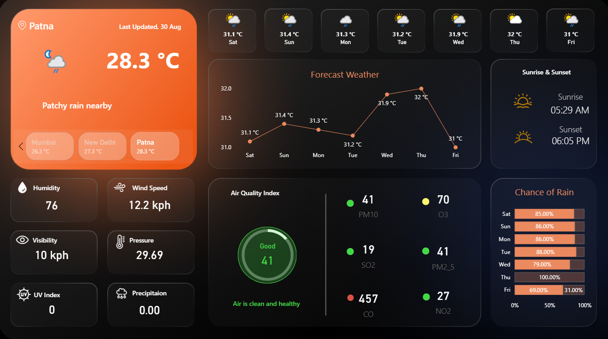
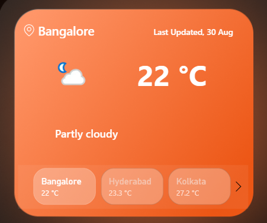
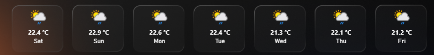
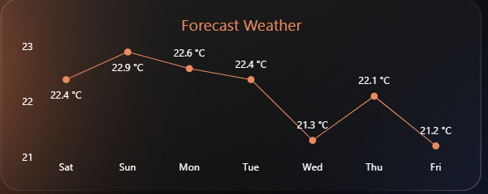
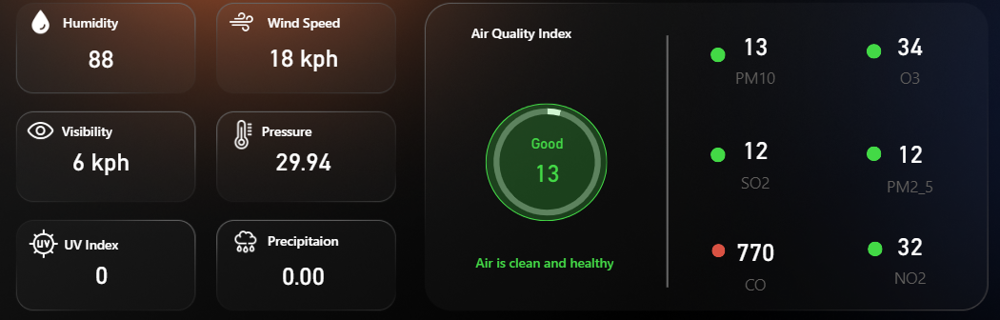
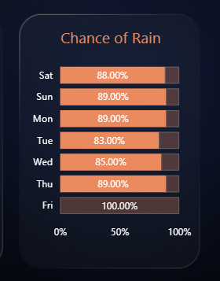
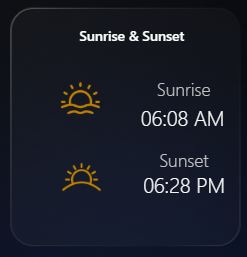

# 🌤️ Power BI Weather & Air Quality Dashboard

An interactive **Power BI dashboard** designed to visualize and analyze weather conditions and Air Quality Index (AQI). The dashboard transforms environmental data into actionable insights using **Power BI, DAX, data modeling, and interactive visualizations**.

---

# 📌 Project Overview

This dashboard provides an intuitive way to monitor weather conditions, forecast temperatures, air quality, rainfall probability, and key environmental metrics. It demonstrates the use of **Power BI dashboards, DAX calculations, KPI design, and data storytelling** to present meaningful insights.

---

# 📊 Dashboard Preview

## 🖥️ Complete Dashboard

---

## 🌤️ Current Weather

Displays the current weather conditions, selected city, and latest update information.

---

## 🌡️ 7-Day Temperature Cards

Quick overview of the upcoming week's weather forecast.

---

## 📈 Weather Forecast

Interactive line chart visualizing the 7-day temperature trend.

---

## 🌫️ Air Quality & Weather Metrics

Displays AQI classification, pollutant concentrations, humidity, pressure, wind speed, visibility, UV index, and precipitation.

---

## 🌧️ Chance of Rain

Visualizes daily rainfall probability using an interactive bar chart.

---

## 🌅 Sunrise & Sunset

Displays sunrise and sunset timings.

---

# 🔑 Key Features

- 🌦️ Interactive weather dashboard built in Microsoft Power BI
- 🌫️ Dynamic AQI classification with color-coded indicators
- 📈 7-day weather forecast visualization
- 🌧️ Rain probability analysis
- 🌡️ Temperature summary cards
- 💨 Environmental metrics including humidity, pressure, wind speed, visibility, UV index, and precipitation
- 🌅 Sunrise & Sunset information
- 📊 Interactive dashboard for data exploration and storytelling

---

# 🛠️ Tools & Technologies

- Microsoft Power BI
- DAX (Data Analysis Expressions)
- Data Modeling
- Data Visualization
- KPI Design
- Interactive Reporting
- Data Storytelling

---

# 📈 Key Dashboard Insights

- Monitors weather conditions across multiple cities.
- Classifies Air Quality Index (AQI) into health-based categories.
- Tracks pollutant levels including PM10, PM2.5, CO, NO₂, O₃, and SO₂.
- Visualizes rainfall probability and temperature trends.
- Provides environmental insights through interactive visuals and KPI cards.

---

# 🚀 How to Use

1. Clone or download this repository.
2. Open **weather dashboard.pbix** in Microsoft Power BI Desktop.
3. Refresh the data (if required).
4. Explore the interactive dashboard and visualizations.

---

# 📚 Learning Outcomes

- Developed interactive dashboards using Microsoft Power BI.
- Applied DAX measures and calculated columns.
- Designed KPI cards and analytical visualizations.
- Strengthened data modeling and dashboard design skills.
- Improved data storytelling and visualization techniques.

---

# 📄 License

This project is intended for educational and portfolio purposes.
